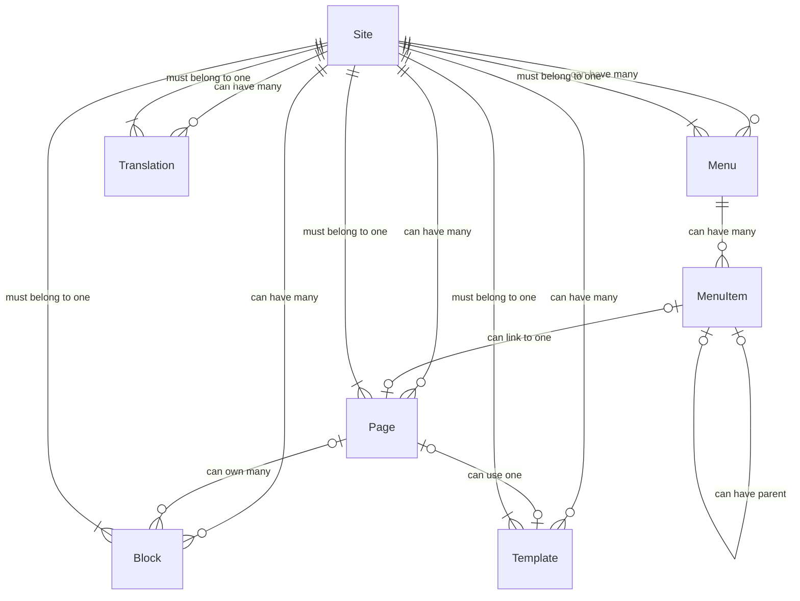

# Architecture Overview

## System Components

The CMS Store is built with a modular architecture, consisting of the following main components:

### Core Components

1. **Blocks**
   - Manages content blocks
   - Handles block rendering and storage
   - Supports dynamic content insertion

2. **Menus**
   - Menu management system
   - Hierarchical menu structure
   - Dynamic menu item handling

3. **Pages**
   - Page content management
   - URL routing and handling
   - Template integration

4. **Templates**
   - Template management
   - Theme support
   - Layout handling

5. **Translations**
   - Multi-language support
   - Content localization
   - Language switching

## Entity Relationships

### Core Entity Structure

### Entity Relationships Explained

1. **Site-Centric Architecture**
   - Sites are the top-level entities
   - Each site can have zero or many:
     * Pages
     * Templates
     * Blocks
     * Menus
     * Translations
   - All entities must belong to exactly one site

2. **Page Relationships**
   - Each page must belong to exactly one site
   - Each page can optionally use one template
   - Each page can own zero or many blocks
   - Pages can be optionally linked from zero or many menu items

3. **Menu Structure**
   - Each menu must belong to exactly one site
   - Each menu can have zero or many menu items
   - Each menu item:
     * Can optionally link to one page
     * Can optionally have one parent menu item
     * Can have zero or many child menu items

4. **Content Management**
   - Each block:
     * Must belong to exactly one site
     * Can either belong to one specific page or be global (available to all pages)
   - Each template must belong to exactly one site
   - Each translation must belong to exactly one site

## Database Schema

The system uses a relational database with the following key tables:
- `site` - Stores site information and configuration
- `page` - Stores page content and metadata
- `block` - Stores reusable content blocks (with optional page_id for page-specific blocks)
- `menu` - Stores menu structures
- `menu_item` - Stores menu items and their relationships
- `template` - Stores page templates
- `translation` - Stores multi-language content

Each table includes:
- Unique identifiers
- Timestamps (created_at, updated_at)
- Soft delete support
- Status tracking
- Metadata storage

## Middleware System

The CMS implements a middleware system for:
- Authentication
- Authorization
- Caching
- Request/Response handling

## Future Improvements

- Automated schema management
- Enhanced middleware management
- Code generation for query structs
- Foreign key constraints implementation
- Domain name normalization 