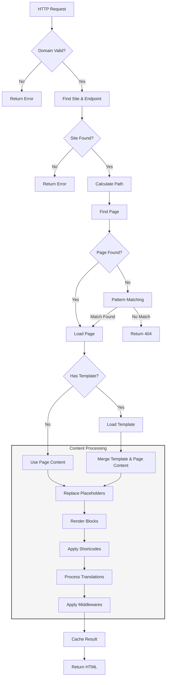

# Frontend Implementation Overview

The frontend implementation of the CMS is built with a focus on flexibility, performance, and maintainability. This document outlines the key components and processes involved in rendering content.

## Core Components

### Request Flow Diagram



#### Request Flow Explanation

1. **Initial Request Processing**
   - Request enters the system
   - Domain validation is performed
   - System attempts to find matching site and endpoint

2. **Site Resolution**
   - If site is not found, returns error
   - If site is found, calculates the actual path by removing site endpoint prefix
   - Handles multi-site scenarios efficiently

3. **Page Resolution**
   - Attempts to find page by exact path match
   - If not found, tries pattern matching
     * Supports dynamic URL patterns (`:any`, `:num`, etc.)
     * Falls back to 404 if no match found

4. **Content Processing Pipeline**
   1. **Template Handling**
      - Check if page has a template
      - If yes: Load template and merge with page content
      - If no: Use page content directly
   2. **Content Processing Steps**
      - Replace placeholders (metadata like `[[PageTitle]]`, etc.)
      - Render blocks (`[[BLOCK_id]]` tags)
      - Apply shortcodes
      - Process translations
      - Apply middlewares
   3. **Final Steps**
      - Cache the result
      - Return final HTML

The entire process is optimized for performance through:
- Strategic caching at multiple levels
- Lazy loading of content
- Efficient database queries
- Pattern matching optimization

### 1. Request Handler

The frontend uses a main handler that processes incoming HTTP requests:

```go
func (frontend *frontend) Handler(w http.ResponseWriter, r *http.Request) {
    w.Write([]byte(frontend.StringHandler(w, r)))
}
```

The handler performs several key functions:
- Domain and path resolution
- Site identification
- Language detection
- Content rendering

### 2. Rendering Pipeline

The content rendering process follows a specific sequence:

1. **Page Resolution**
   - Finds the appropriate page based on site ID and alias
   - Supports pattern matching for dynamic URLs (e.g., `:any`, `:num`, `:alpha`)
   - Falls back to default handling if page not found

2. **Content Processing**
   ```
   [Template Merge (if template exists)] -> Placeholders -> Blocks -> Shortcodes -> Translations -> Middlewares -> Final HTML
   ```

   The sequence is:
   1. If page has a template:
      - Load template
      - Merge template with page content
   2. Process the content (either merged or page content):
      - Replace placeholders (metadata like `[[PageTitle]]`, etc.)
      - Render blocks (`[[BLOCK_id]]` tags)
      - Apply shortcodes (custom content generators)
      - Process translations
      - Apply middlewares
   3. Cache and return the final HTML

3. **Template Integration**
   - Pages can optionally use templates
   - Template content is loaded and merged with page content FIRST
   - Further processing (blocks, shortcodes, translations) happens after template integration
   - Supports dynamic content insertion via placeholders

### 3. Content Elements

#### Blocks
- Can be page-specific or global
- Referenced using `[[BLOCK_blockID]]` syntax
- Content is cached for performance
- Supports both static and dynamic content

#### Templates
- Define the overall layout
- Support placeholder substitution
- Can include blocks and translations
- Cached for performance

#### Shortcodes
- Custom content generators
- Use `<shortcode>` syntax
- Support dynamic parameters
- Extensible through custom implementations

#### Translations
- Multi-language support
- Referenced using `[[TRANSLATION_translationID]]`
- Language-specific content rendering
- Fallback to default language

## Caching System

The frontend implements a TTL-based caching system:

```go
type frontend struct {
    cacheEnabled       bool
    cacheExpireSeconds int
    cache              *ttlcache.Cache[string, any]
}
```

Key features:
- Configurable cache duration
- Automatic cache warming
- Cache invalidation on content updates
- Supports all content types (blocks, templates, translations)

## Content Placeholders

The system supports various placeholder types:

1. **Page Metadata**
   - `[[PageTitle]]`
   - `[[PageContent]]`
   - `[[PageCanonicalUrl]]`
   - `[[PageMetaDescription]]`
   - `[[PageMetaKeywords]]`
   - `[[PageRobots]]`

2. **Dynamic Content**
   - `[[BLOCK_id]]` for blocks
   - `[[TRANSLATION_id]]` for translations

## URL Pattern Support

The CMS supports dynamic URL patterns:

- `:any` - Matches any non-slash character
- `:num` - Matches numeric values
- `:all` - Matches everything
- `:string` - Matches alphabetic strings
- `:number` - Matches numeric values
- `:numeric` - Matches numbers with decimals
- `:alpha` - Matches alphanumeric characters

Example:
```
/blog/:num/:any
/shop/product/:num/:alpha
```

## Performance Optimizations

1. **Caching**
   - Content caching with TTL
   - Cache warming on startup
   - Selective cache invalidation

2. **Efficient Content Loading**
   - Lazy loading of blocks
   - Template caching
   - Optimized database queries

3. **Resource Management**
   - Favicon handling
   - Static file optimization
   - Response streaming

## Error Handling

The frontend implements comprehensive error handling:

1. **Domain Validation**
   - Checks for supported domains
   - Provides clear error messages

2. **Content Loading**
   - Graceful handling of missing content
   - Fallback content options
   - Detailed error logging

3. **Rendering Errors**
   - Template parsing errors
   - Block rendering failures
   - Translation missing handlers

## Middleware System

The CMS supports middleware for request/response processing:

- Authentication
- Authorization
- Caching
- Custom request/response handling

## Configuration

The frontend is configured through the `Config` struct:

```go
type Config struct {
    BlockEditorRenderer func(blocks []ui.BlockInterface) string
    Logger             *slog.Logger
    Store              cmsstore.StoreInterface
    CacheEnabled       bool
    CacheExpireSeconds int
}
```

Key configuration options:
- Block rendering function
- Logging configuration
- Store interface
- Cache settings

## Future Improvements

1. **Performance**
   - Enhanced caching strategies
   - Response compression
   - Asset optimization

2. **Features**
   - Advanced URL routing
   - Dynamic middleware loading
   - Extended shortcode capabilities

3. **Development**
   - Improved debugging tools
   - Performance monitoring
   - Extended testing coverage 