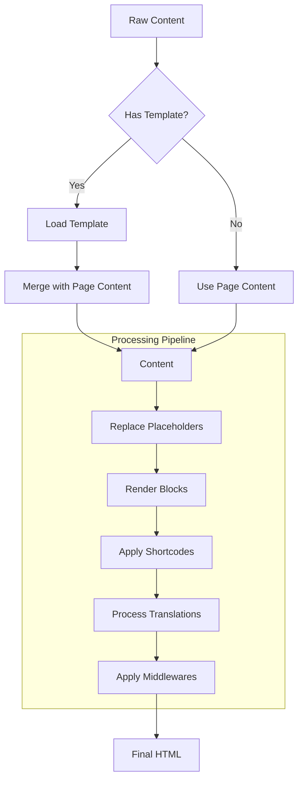

# [Draft] Improve Content Processing Pipeline Documentation

## Summary
- **Problem**: Current documentation of the content processing pipeline lacks clarity in certain areas, particularly around template handling and the exact sequence of operations.
- **Solution**: Enhance documentation with clearer diagrams, detailed sequence explanations, and concrete examples.

## Background

The CMS Store's content processing pipeline is a core component that handles:
- Template integration
- Placeholder replacement
- Block rendering
- Shortcode processing
- Translation handling
- Middleware application

While the basic flow is documented, users and developers have encountered some confusion about:
- When exactly template merging occurs
- How different content elements interact
- The exact sequence of processing steps
- Error handling during each step

## Detailed Design

### 1. Enhanced Flow Documentation



### 2. Processing Steps Documentation

For each step, document:
- Input format
- Output format
- Error handling
- Performance considerations
- Caching strategy

Example for Block Rendering:
```go
// Input: Content with block placeholders
content = "Header [[BLOCK_123]] Footer"

// Processing:
1. Find all block references
2. Load each block (with caching)
3. Render block content
4. Replace placeholder with rendered content

// Output: Content with rendered blocks
content = "Header <div class='block'>Block Content</div> Footer"
```

### 3. Edge Cases and Error Handling

Document how the system handles:
- Missing templates
- Invalid blocks
- Malformed shortcodes
- Missing translations
- Middleware errors

### 4. Performance Optimization Documentation

Add documentation about:
- Caching strategies at each step
- Lazy loading patterns
- Resource management
- Memory usage considerations

## Alternatives Considered

1. **Minimal Documentation**
   - Pros: Less maintenance
   - Cons: More support requests, steeper learning curve
   - Rejected: Clear documentation is crucial for adoption

2. **Video Documentation**
   - Pros: Visual learning
   - Cons: Hard to maintain, search, and update
   - Rejected: Text and diagrams are more maintainable

3. **Separate Docs Site**
   - Pros: More features, better organization
   - Cons: Additional maintenance, sync issues
   - Rejected: In-repo markdown is sufficient

## Implementation Plan

1. Phase 1: Core Documentation (1 week)
   - Update main README
   - Create detailed processing pipeline docs
   - Add sequence diagrams

2. Phase 2: Examples (1 week)
   - Add code examples
   - Create example projects
   - Document common patterns

3. Phase 3: Edge Cases (1 week)
   - Document error handling
   - Add troubleshooting guide
   - Create FAQ

4. Phase 4: Review and Refinement (1 week)
   - Community review
   - Testing with new users
   - Final updates

## Risks and Mitigations

1. **Documentation Drift**
   - Risk: Docs become outdated
   - Mitigation: Regular review process, automated checks

2. **Complexity**
   - Risk: Too much detail overwhelms users
   - Mitigation: Layer information, progressive disclosure

3. **Maintenance**
   - Risk: High maintenance burden
   - Mitigation: Automate where possible, regular review cycle

4. **Adoption**
   - Risk: Users don't read docs
   - Mitigation: Make docs searchable, provide quick start guides 