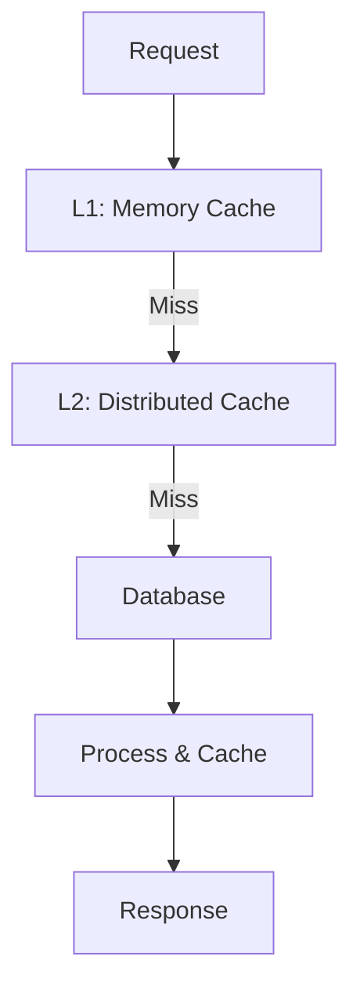

# [Draft] Enhanced Caching Strategy

## Summary
- **Problem**: Current caching implementation is basic TTL-based caching that doesn't optimize for all use cases
- **Solution**: Implement a multi-level caching strategy with intelligent invalidation

## Background

The CMS Store currently uses a simple TTL-based cache:
```go
type frontend struct {
    cacheEnabled       bool
    cacheExpireSeconds int
    cache              *ttlcache.Cache[string, any]
}
```

While functional, this approach has limitations:
- No differentiation between content types
- Potential for stale content
- No partial cache invalidation
- Memory usage not optimized
- No distributed caching support

## Detailed Design

### 1. Multi-Level Cache Architecture



### 2. Cache Levels

1. **L1: Memory Cache (Local)**
   ```go
   type MemoryCache struct {
       blocks      *ttlcache.Cache[string, BlockData]
       pages      *ttlcache.Cache[string, PageData]
       templates  *ttlcache.Cache[string, TemplateData]
       rendered   *ttlcache.Cache[string, string]
   }
   ```

2. **L2: Distributed Cache (Redis)**
   ```go
   type DistributedCache struct {
       client     redis.Client
       prefix     string
       defaultTTL time.Duration
   }
   ```

### 3. Cache Keys and Namespacing

```go
const (
    CacheKeyBlock     = "block:%s"
    CacheKeyPage      = "page:%s"
    CacheKeyTemplate  = "template:%s"
    CacheKeyRendered  = "rendered:%s:%s" // site:path
)
```

### 4. Intelligent Invalidation

1. **Dependency Tracking**
   ```go
   type CacheDependencies struct {
       PageID      string
       BlockIDs    []string
       TemplateID  string
       Language    string
   }
   ```

2. **Invalidation Rules**
   - When a block changes: Invalidate block cache + dependent pages
   - When a template changes: Invalidate template cache + all pages using it
   - When a translation changes: Invalidate affected language versions

### 5. Cache Warming

1. **Startup Warming**
   ```go
   func (c *Cache) WarmFrequentlyAccessed() {
       // Warm most accessed pages
       // Warm global blocks
       // Warm active templates
   }
   ```

2. **Background Refresh**
   ```go
   func (c *Cache) StartBackgroundRefresh(interval time.Duration) {
       // Periodically refresh cache before expiration
   }
   ```

### 6. Memory Management

1. **Size Limits**
   ```go
   type CacheConfig struct {
       MaxMemoryMB      int
       MaxItemsPerType  int
       EvictionPolicy   string // LRU, LFU, etc.
   }
   ```

2. **Item Prioritization**
   - Frequently accessed items kept in memory
   - Larger items in distributed cache
   - Dynamic TTL based on access patterns

## Alternatives Considered

1. **Single Redis Cache**
   - Pros: Simpler implementation
   - Cons: Higher latency for frequent access
   - Rejected: Need fast local cache for performance

2. **File-based Cache**
   - Pros: No memory pressure
   - Cons: I/O overhead, harder to manage
   - Rejected: Performance requirements

3. **Pure Memory Cache**
   - Pros: Fastest possible
   - Cons: No distribution, memory pressure
   - Rejected: Need distributed support

## Implementation Plan

1. Phase 1: Cache Infrastructure (2 weeks)
   - Implement cache interfaces
   - Set up Redis integration
   - Add basic multi-level caching

2. Phase 2: Intelligent Invalidation (2 weeks)
   - Implement dependency tracking
   - Add invalidation rules
   - Test cache consistency

3. Phase 3: Optimization (2 weeks)
   - Add cache warming
   - Implement memory management
   - Performance testing

4. Phase 4: Monitoring (1 week)
   - Add cache metrics
   - Create monitoring dashboard
   - Document operations

## Risks and Mitigations

1. **Memory Usage**
   - Risk: Excessive memory consumption
   - Mitigation: Strict limits, monitoring, eviction policies

2. **Cache Consistency**
   - Risk: Stale or invalid content
   - Mitigation: Thorough invalidation rules, versioning

3. **Redis Dependency**
   - Risk: Redis failures impact system
   - Mitigation: Fallback to memory cache, circuit breakers

4. **Performance Impact**
   - Risk: Cache overhead exceeds benefits
   - Mitigation: Benchmark-driven development, feature flags 