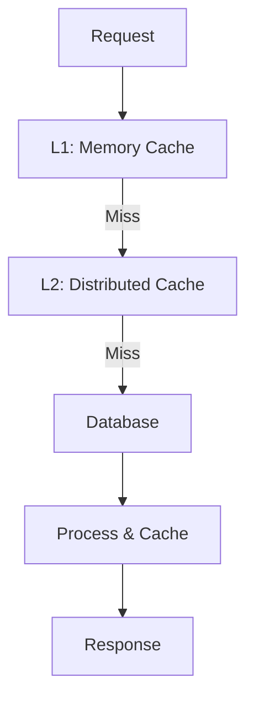

# [Draft] Enhanced Caching Strategy

## Status
**[Draft]** - Basic TTL caching implemented, enhanced features pending

## Summary
- **Problem**: Current caching implementation is basic TTL-based caching that doesn't optimize for all use cases
- **Solution**: Implement a multi-level caching strategy with intelligent invalidation

## Current Implementation (As-Is)

The CMS Store currently uses a simple TTL-based cache:

```go
type frontend struct {
    cacheEnabled       bool
    cacheExpireSeconds int
    cache              *ttlcache.Cache[string, any]
}
```

**Files:**
- `frontend/new.go` - Cache configuration and initialization
- `frontend/frontend_cache.go` - Cache operations (`CacheHas`, `CacheGet`, `CacheSet`)
- `frontend/init.go` - Cache initialization

**Current Features:**
- Basic TTL-based caching with `ttlcache` library
- Cache warming for active sites (`warmUpCache()`)
- Per-key expiration control (error states = 10s, normal = cacheExpireSeconds)
- Cache enable/disable toggle

**Current Cache Keys:**
- `block_content_{id}` - Block rendered content
- `page_site:{siteID}:alias:{alias}` - Page lookups
- `page_alias_map_site:{siteID}` - Site page alias maps
- `sites_active` - Active sites list
- `find_site_and_endpoint_*` - Site endpoint resolution
- `page_url_{id}` - Page URL resolution

## Limitations (Why Enhanced Strategy Needed)

Current approach has limitations:
- No differentiation between content types (all use same TTL)
- No partial cache invalidation (must wait for TTL or clear all)
- No dependency tracking (changing a block doesn't invalidate pages using it)
- No distributed caching support (single-node only)
- No memory usage limits or eviction policies
- No cache metrics or monitoring

## Proposed Enhanced Design (To-Be)

### 1. Multi-Level Cache Architecture


```mermaid
flowchart TD
    A[Request] --> B[L1: Memory Cache]
    B -->|Miss| C[L2: Distributed Cache]
    C -->|Miss| D[Database]
    D --> E[Process & Cache]
    E --> F[Response]
```

### 2. Cache Levels

1. **L1: Memory Cache (Local)**
   ```go
   type MemoryCache struct {
       blocks      *ttlcache.Cache[string, BlockData]
       pages      *ttlcache.Cache[string, PageData]
       templates  *ttlcache.Cache[string, TemplateData]
       rendered   *ttlcache.Cache[string, string]
   }
   ```

2. **L2: Distributed Cache (Redis)**
   ```go
   type DistributedCache struct {
       client     redis.Client
       prefix     string
       defaultTTL time.Duration
   }
   ```

### 3. Intelligent Invalidation

1. **Dependency Tracking**
   ```go
   type CacheDependencies struct {
       PageID      string
       BlockIDs    []string
       TemplateID  string
       Language    string
   }
   ```

2. **Invalidation Rules**
   - When a block changes: Invalidate block cache + dependent pages
   - When a template changes: Invalidate template cache + all pages using it
   - When a translation changes: Invalidate affected language versions

### 4. Cache Warming

```go
func (c *Cache) WarmFrequentlyAccessed() {
    // Warm most accessed pages
    // Warm global blocks
    // Warm active templates
}
```

### 5. Memory Management

```go
type CacheConfig struct {
    MaxMemoryMB      int
    MaxItemsPerType  int
    EvictionPolicy   string // LRU, LFU, etc.
}
```

## Implementation Status

| Feature | Status | Notes |
|---------|--------|-------|
| Basic TTL caching | Implemented | `ttlcache` library |
| Cache warming | Partial | Only active sites warmed |
| Multi-level cache | Not implemented | L1/L2 architecture |
| Redis distributed | Not implemented | Requires Redis dependency |
| Dependency tracking | Not implemented | Invalidation is manual |
| Memory limits | Not implemented | No eviction policy |
| Cache metrics | Not implemented | No monitoring |

## Files to Modify (If Implementing)

1. `frontend/frontend_cache.go` - Extend with new cache operations
2. `frontend/new.go` - Add cache configuration options
3. `admin/shared/caches.go` - Admin cache management UI already exists
4. New: `frontend/cache_multilevel.go` - Multi-level cache implementation
5. New: `frontend/cache_redis.go` - Redis adapter
6. New: `frontend/cache_dependencies.go` - Dependency tracking

## Risks and Mitigations

1. **Memory Usage**
   - Risk: Excessive memory consumption
   - Mitigation: Strict limits, monitoring, eviction policies

2. **Cache Consistency**
   - Risk: Stale or invalid content
   - Mitigation: Thorough invalidation rules, versioning

3. **Redis Dependency**
   - Risk: Redis failures impact system
   - Mitigation: Fallback to memory cache, circuit breakers

4. **Performance Impact**
   - Risk: Cache overhead exceeds benefits
   - Mitigation: Benchmark-driven development, feature flags